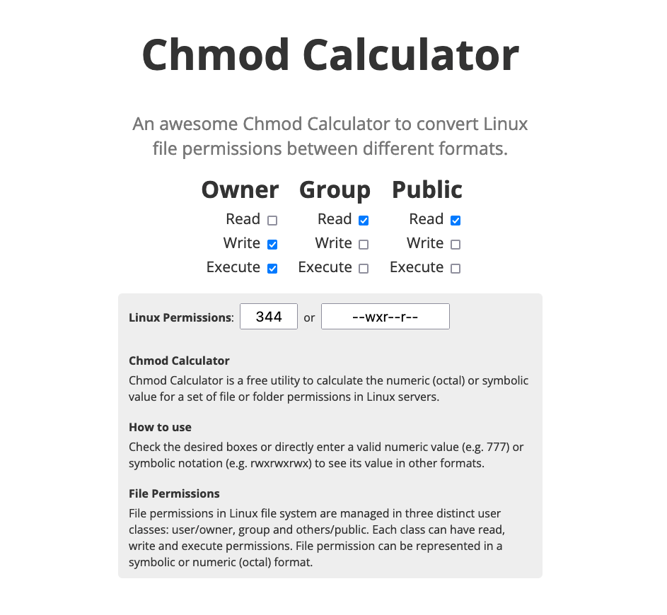

# CHMOD CALCULATOR

A simple html webpage that allow you to convert chmod octal to symbolic and vice versa.

Here is an example of the webpage:

### Inspiration

This project was inspired by the website: www.chmod-calculator.com
